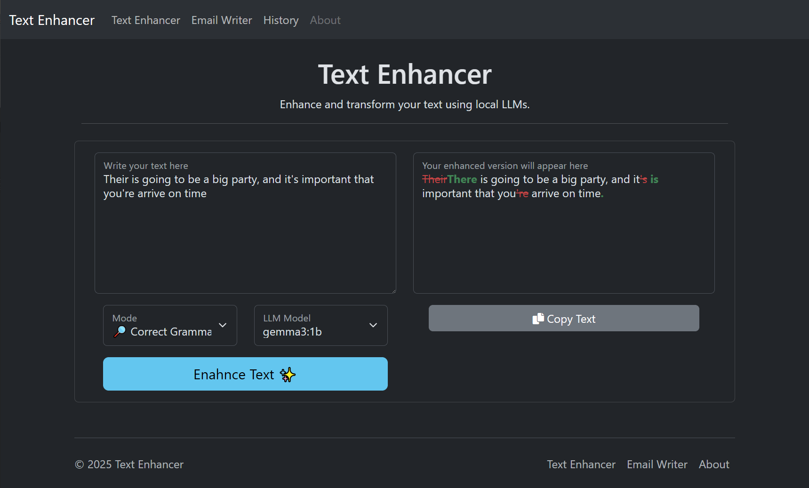
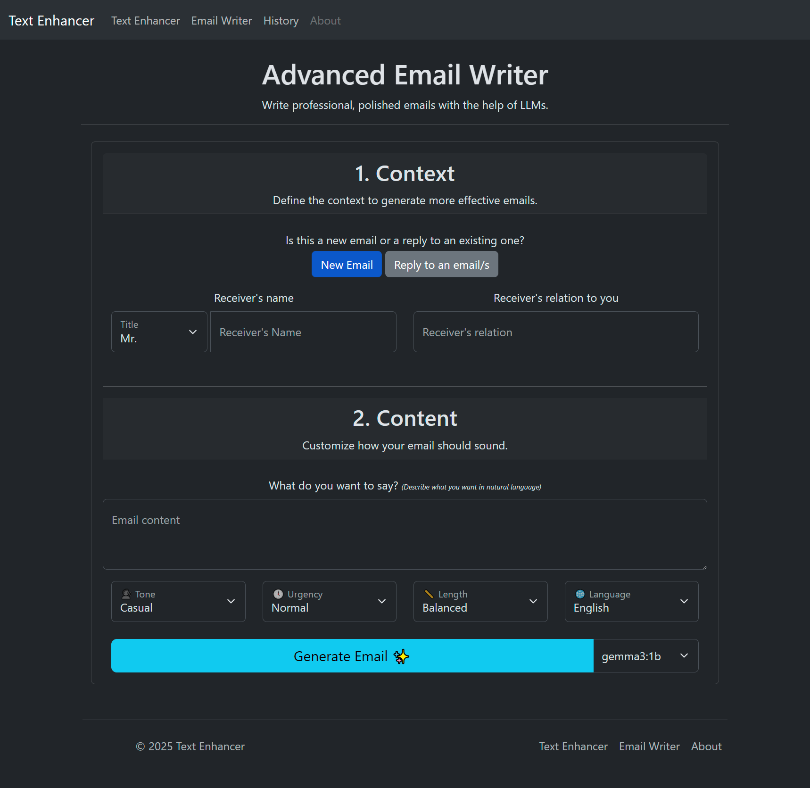

# Text Enhancer ✨

A tool that uses Ollama's LLMs to enhance your text, and even generate emails.



## 📖 About

This project is an experiment I built to enhance and correct my writing locally using Ollama's models.

I usually rely on [Quillbot](https://quillbot.com/grammar-check), [Grammarly](https://www.grammarly.com/grammar-check), or even public chatbots like [ChatGPT](https://chatgpt.com/) to check and enhance my writing. However, I needed a way to do that **quickly and locally**.

So I built this tool. It's a simple **Express.js** application that makes **API requests** to **Ollama**. I can manage whether I want to just **correct grammar** or **enhance phrasing**. 

- **🏠 Everything is Local**: No internet connection required, and your text never leaves your machine _(privacy go brrr)_.

- **🌱 Lightweight & eco-friendlier**: No need to run ~500B cloud models for simple grammar correction.

- **✍️ Functional and fun**: started as a **text enhancer**, but I also added an **email writer** page for testing… and it actually works!


## ✨ Features 

### 1. Text Enhancer

Enhance your text by **correcting grammar** and **improving phrasing**.

You can:
- Correct **Grammar**
- Improve **Phrasing**
- Change the text **tone**


### 2. Email Writer

Write professional **context-aware** emails using **natural input**. Set custom tone, urgency, and length.



## 🛠️ Tech Stack

> *"An idiot admires complexity; a genius admires simplicity."* - Terry A. Davis

- **Frontend**: HTML, CSS, JS, and [Bootstrap](https://getbootstrap.com/).

- **Backend**: [Express.js](https://expressjs.com/), [EJS](https://ejs.co/), and [Ollama](https://ollama.com/).

This stack is enough for my use case. It's dynamic, fast, and gets the job done in a secure and efficient manner.

## 🚀 Installation

You will need:

- [git](https://git-scm.com/downloads)
- [Node.js](https://nodejs.org/en/download/)
- [Ollama Server](https://ollama.com/download)
- 5GB+ Free disk space
- Dedicated GPU is preferred

1. **Clone the project**

```bash
git clone https://github.com/CuzImAzizx/text-enhancer
cd text-enhancer
```

2. **Install the dependencies**

```bash
npm i
```

3. Make sure that you have the model you want to use on Ollama, `gemma3:4b` works fine.

```bash
ollama pull gemma3:4b
```

4. _(optional)_ Update the variables at the start of `server.js` if necessary

```js
// ==== Start config ====
const appPort = 8404;
const ollamaURL = "http://127.0.0.1:11434"; // Avoid using http when Ollama is not on the same host
const allowedModels = []; // Set this array empty to allow all models
const keepAlive = -1; // -1 To keep the model up indefinitely, 0 to unload immediately, 5 to unload after 5 minutes.
// ==== End config
```

5. Start the app

```
node server.js
```

6. Access the app on `http://localhost:8404` _or whatever port you set_

## ⚠️ Disclaimer

**This app is NOT meant for production use**, there's no input validation on the API, no strict security, just experiments, exploration, and learning.

So please, don’t expose it publicly.

- [ ] *TODO: Secure the app (Authentication, Validation, Rate limiting, etc.)*

### 💀 List of potential vulnerabilities:
1. Denial of Service
2. Prompt Injection
3. Unvalidated Inputs
4. Remote Code Execution via LLM
5. Lack of Authentication/Authorization
6. ~~CSRF~~ _No authentication to begin with_
7. Direct API Access
8. Frontend Variable Tampering
9. Information Disclosure
10. Ollama API Misconfiguration

## Why I made this

- I wanted a **local** + **free alternative** to Grammarly and Quillbot.

- To **learn** more about Ollama, prompt engineering, APIs, DOM manipulation, and solving problems.
